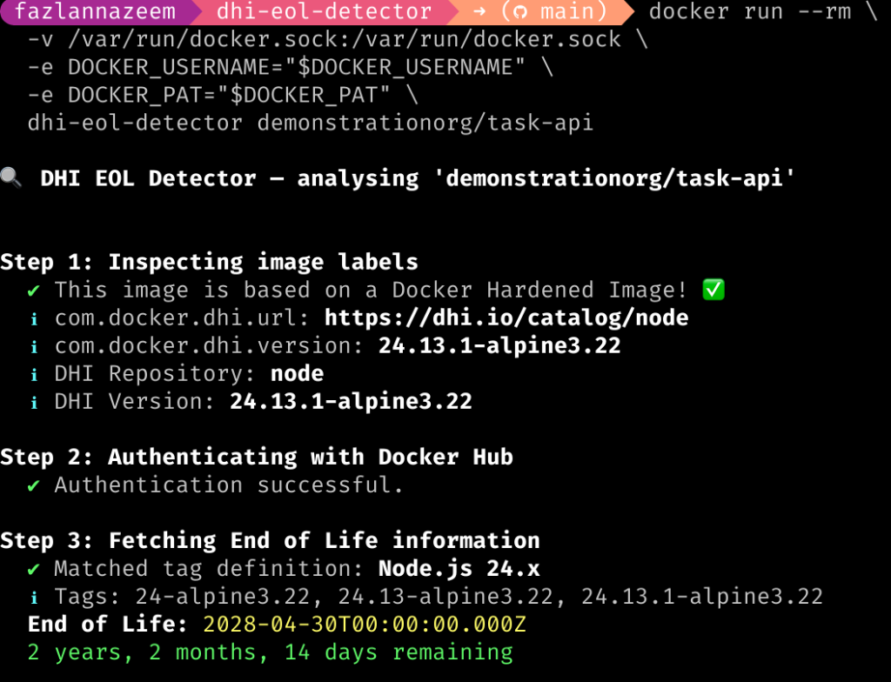

# DHI EOL Detector

A CLI tool that inspects a Docker image, extracts its base image, verifies whether it is a **Docker Hardened Image (DHI)**, and retrieves its **End of Life / End of Support** dates from the Docker Scout GraphQL API.

## Prerequisites

- **Docker** running locally
- **Docker Hub credentials** with access to Docker Scout:
  - `DOCKER_USERNAME` — your Docker Hub username
  - `DOCKER_PAT` — a Personal Access Token

## Quick Start

### Build the image

```bash
docker build -t dhi-eol-detector .
```

### Run

```bash
docker run --rm \
  -v /var/run/docker.sock:/var/run/docker.sock \
  -e DOCKER_USERNAME="your-username" \
  -e DOCKER_PAT="your-pat" \
  dhi-eol-detector <image-name>
```

> **Note:** The Docker socket mount (`-v /var/run/docker.sock:...`) is required so the tool can run `docker inspect` on images available on your host and `docker pull` if the image needs to be pulled.

### Examples

```bash
# Check if an image uses a DHI base and get its EOL dates
docker run --rm \
  -v /var/run/docker.sock:/var/run/docker.sock \
  -e DOCKER_USERNAME="$DOCKER_USERNAME" \
  -e DOCKER_PAT="$DOCKER_PAT" \
  dhi-eol-detector myapp:latest
```

### Sample Output



## How It Works

1. **Inspect image labels** — pulls the image if not available locally, then reads labels via `docker inspect`
2. **Check for DHI labels** — looks for `com.docker.dhi.url` and `com.docker.dhi.version`. If present, the image is a based of a Docker Hardened Image. If not, it stops and reports it is not based of a DHI.
3. **Fetch EOL dates** — authenticates with Docker Hub (PAT → JWT) and queries the `dhiRepository` GraphQL API for the `endOfLife` date matching the image version
